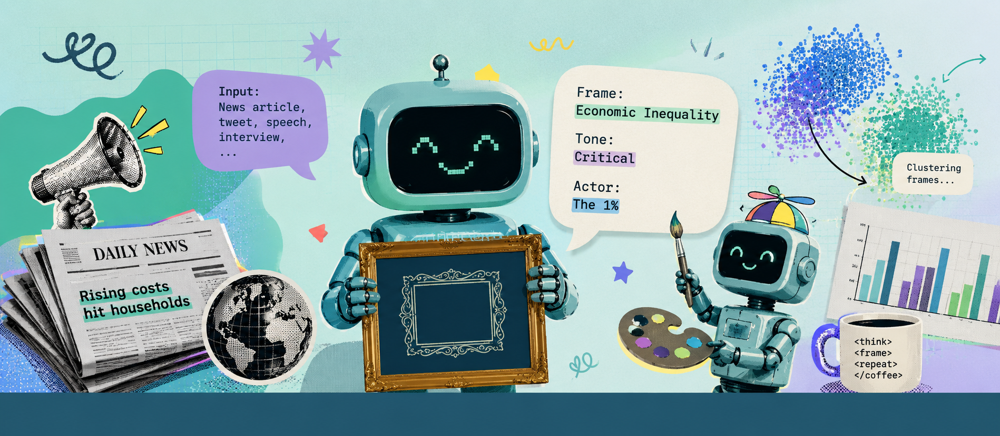

# Using Large Language Models for Frame Measurement and Other Shenanigans

#### DiMES Workshop at FU Berlin

This workshop provides an introduction to fundamentals of natural language processing (NLP) and large language models (LLMs) for political communication research. It covers basic and advanced text representation, fundamentals of machine learning, the inner workings of LLMs, and applied questions regarding LLMs. The course consists of nine sessions, consisting of lectures with a conceptual focus and hands-on tutorials. The course is designed to provide a fast overview of major topics in the application of LLMs. It covers most content rather superficially, aiming to provide students with a good overview of available tools, intuition of each concept, and code as a starting point to implement their own ideas.

## Schedule

| Time | Session |
|---|--------|
| **Thursday, July 9** | **Fundamentals** |
| 9:00–10:00 | 1: Welcome & Intro to Python, Colab |
| 10:05–10:50 | 2: Representing Text |
| 11:00–12:15 | 3: Embeddings |
| 12:15–13:15 | *Lunch* |
| 13:15–14:45 | 4: Supervised Machine Learning |
| 15:00–15:45 | 5: Transformer Models (short session) |
| 16:00 | *Inaugural lecture Christian von Sikorski* |
| **Friday, July 10** | **Working with LLMs** |
| 9:00–10:30 | 6: Generative LLMs & Training |
| 10:30–12:00 | 7: Inference, APIs & Hosting |
| 12:00–13:30 | *Lunch* |
| 13:30–15:00 | 8: Measuring Concepts in Text |
| 15:15–16:45 | 9: Validation, Debiasing, and more |

## Day 1 (Thursday, July 9)

### Session 1: Welcome & Intro to Python, Colab

Introduction round and course overview. We discuss why NLP matters for political communication research, walk through examples of what text-as-data methods can do, and set up our shared working environment. The tutorial introduces Google Colab and Python basics.

🖥️ [Lecture Slides](https://nicoberk.quarto.pub/llm_ws-lecture-1/)

#### Resources

- **Python Tutorial**: [Beginners' Guide to Python](https://wiki.python.org/moin/BeginnersGuide)
- **Introduction to Google Colab**: [Welcome to Colab](https://colab.research.google.com/notebooks/intro.ipynb)
- [pandas cheatsheet](https://pandas.pydata.org/Pandas_Cheat_Sheet.pdf)

### Session 2: Representing Text

How do we turn text into numbers? This session introduces the bag-of-words representation, dictionary-based measures, tokenization, stemming, and feature selection — and discusses what gets lost along the way. The tutorial covers pandas and basic text representation in Python.

🖥️ [Lecture Slides](https://nicoberk.quarto.pub/representing-text/)

#### Further Reading

- Grimmer, J., Roberts, M. E., & Stewart, B. M. (2022). Bag of Words. In *Text as data: A new framework for machine learning and the social sciences*. Princeton University Press.
- Jurafsky, D., & Martin, J. H. (2026). [*Speech and Language Processing. Chapter 2.* (3rd ed. draft)](https://web.stanford.edu/~jurafsky/slp3/2.pdf).

### Session 3: Embeddings

From counting words to representing meaning: the distributional hypothesis, how word2vec learns word vectors from context, and how to work with embeddings — semantic axes, projection, cosine similarity, and document embeddings. The tutorial covers embedding manipulation with `gensim`.

🖥️ [Lecture Slides](https://nicoberk.quarto.pub/embeddings/)

#### Further Reading

- **Explainer on Algorithm behind Word Embeddings**: McCormick, C. (2016, April 19). [Word2Vec tutorial - The skip-gram model](https://mccormickml.com/2016/04/19/word2vec-tutorial-the-skip-gram-model/). *Chris McCormack's Blog*.
- Jurafsky, D., & Martin, J. H. (2026). [*Speech and Language Processing. Chapter 5.* (3rd ed. draft)](https://web.stanford.edu/~jurafsky/slp3/5.pdf).
- [`gensim` documentation and tutorials on embeddings](https://radimrehurek.com/gensim/auto_examples/index.html#documentation)

**Technical Papers**

- **Word Embeddings**: Mikolov, Tomas, Kai Chen, Greg Corrado, and Jeffrey Dean. 2013. “Efficient Estimation of Word Representations in Vector Space.” arXiv Preprint arXiv:1301.3781. 
- **Document Embeddings**: Le, Quoc, and Tomas Mikolov. 2014. “Distributed Representations of Sentences and Documents.” In International Conference on Machine Learning, 1188–96. PMLR.
- **Embedding Regression**: Rodriguez, Pedro L, Arthur Spirling, and Brandon M Stewart. 2023. “Embedding Regression: Models for Context-Specific Description and Inference.” American Political Science Review 117 (4): 1255–74. 

**Social Science Applications**

- **Studying word Meaning with Embeddings**: Kozlowski, Austin C, Matt Taddy, and James A Evans. 2019. “The Geometry of Culture: Analyzing the Meanings of Class Through Word Embeddings.” American Sociological Review 84 (5): 905–49. 
- **Measuring Bias and Stereotypes with Word Embeddings**: Kroon, Anne C, Damian Trilling, and Tamara Raats. 2021. “Guilty by Association: Using Word Embeddings to Measure Ethnic Stereotypes in News Coverage.” Journalism & Mass Communication Quarterly 98 (2): 451–77.
- **Scaling Representatives with Document Embeddings**: Rheault, Ludovic, and Christopher Cochrane. 2020. “Word Embeddings for the Analysis of Ideological Placement in Parliamentary Corpora.” Political Analysis 28 (1): 112–33.
- **Studying over-time Changes in Word Meaning**: Rodman, Emma. 2020. “A Timely Intervention: Tracking the Changing Meanings of Political Concepts with Word Vectors.” Political Analysis 28 (1): 87–111.

### Session 4: Supervised Machine Learning

An introduction to the logic of supervised machine learning for text with practical application: annotation, train/test splits, model fitting, prediction, and evaluation. We discuss common evaluation metrics and their pitfalls, the bias-variance tradeoff, and over- and underfitting. 

🖥️ [Lecture Slides](https://nicoberk.quarto.pub/supervised-machine-learning/)

#### Further Reading

- [Visual Explanation of the Bias-Variance Tradeoff](https://mlu-explain.github.io/bias-variance/), [Machine Learning University](https://mlu-explain.github.io/)
- [Google's Machine Learning Crash Course](https://developers.google.com/machine-learning/crash-course)
- [scikit-learn documentation](https://scikit-learn.org/stable/) — not only a documentation of the major library for machine learning, but a great resource of tutorials and explainers.
- [Hugging Face guide on understanding learning curves](https://huggingface.co/learn/llm-course/chapter3/5)
- Grimmer, J., & Stewart, B. M. (2013). Text as data: The promise and pitfalls of automatic content analysis methods for political texts. *Political Analysis*, 21(3), 267–297.
- Tomas-Valiente, Francisco. (2026). Uncertain performance: How to quantity uncertainty and draw test sets when evaluating classifiers. Working paper.

### Session 5: Transformer Models (short session)

The building blocks of modern language models: subword tokenization, the attention mechanism, contextualized embeddings, and the encoder architecture (e.g., BERT). We discuss how classification heads turn pre-trained encoders into measurement tools.

🖥️ [Lecture Slides](https://nicoberk.quarto.pub/transformer-models/)

#### Further Reading

- Tunstall, L., von Werra, L., & Wolf, T. (2022). *Natural Language Processing with Transformers*. O'Reilly Media.
- Jurafsky, D., & Martin, J. H. (2026). [*Speech and Language Processing. Chapter 7.* (3rd ed. draft)](https://web.stanford.edu/~jurafsky/slp3/7.pdf).
- Jurafsky, D., & Martin, J. H. (2026). [*Speech and Language Processing. Chapter 8.* (3rd ed. draft)](https://web.stanford.edu/~jurafsky/slp3/8.pdf).

## Day 2 (Friday, July 10)

### Session 6: Generative LLMs & Training

How decoder models generate text, and how they differ from encoders. We cover the three stages of LLM training — pre-training, fine-tuning, and post-training (e.g., RLHF) — the chat structure of modern assistants, and the Hugging Face ecosystem for working with open models.

#### Further Reading

- Tunstall, L., von Werra, L., & Wolf, T. (2022). *Natural Language Processing with Transformers*. O'Reilly Media.
- Jurafsky, D., & Martin, J. H. (2026). [*Speech and Language Processing. Chapter 9.* (3rd ed. draft)](https://web.stanford.edu/~jurafsky/slp3/9.pdf).
- Jurafsky, D., & Martin, J. H. (2026). [*Speech and Language Processing. Chapter 10.* (3rd ed. draft)](https://web.stanford.edu/~jurafsky/slp3/10.pdf).

**Further resources**

- [LLM Visualization by Brendan Bycroft](https://bbycroft.net/llm) — full interactive visualization of GPT architecture with simple explanations of each step.
- [Jay Alammar's Illustrated Transformer](https://jalammar.github.io/illustrated-transformer/) — accessible visual explanation of the transformer architecture.
- [Transformer Explainer](https://poloclub.github.io/transformer-explainer/) — interactive visualization of the transformer forward pass.

### Session 7: Inference, APIs & Hosting

Using LLMs for annotation in practice: prompting, zero-/few-/dynamic few-shot labelling, retrieval-augmented generation, and synthetic annotation. We cover zero-shot classification with NLI encoder models, hosting options (Hugging Face inference endpoints, local hosting), commercial APIs (OpenAI, Anthropic, Azure), structured output, and tool use.

#### Further Reading

- Laurer, M., van Atteveldt, W., Casas, A., & Welbers, K. (2024). Less annotating, more classifying: Addressing the data scarcity issue of supervised machine learning with deep transfer learning and BERT-NLI. *Political Analysis*, 32(1), 84–100.

**Further resources**

- [Google prompting guide](https://services.google.com/fh/files/misc/gemini-for-google-workspace-prompting-guide-101.pdf)

### Session 8: Measuring Concepts in Text

How to get from a social science concept to a measurement: conceptualization, operationalization, and method choice. Using framing as a case study, we compare how different definitions imply different measurement strategies. In the interactive part, participants develop a measurement strategy for a concept from their own research with their neighbors, pitch it to the group, and collect feedback — before prototyping their measure in the tutorial.

### Session 9: Validation, Debiasing, Security, Privacy, Reproducibility

What makes a measure valid, and how do we show it? We cover convergent, content, and hypothesis-based validation, best practices for validating LLM annotations, bias in LLM predictions and design-based supervised learning (DSL) for debiasing downstream analyses, as well as reproducibility, research ethics, security, and data protection when working with LLMs.

**Literature**

- Adcock, R., & Collier, D. (2001). Measurement validity: A shared standard for qualitative and quantitative research. *American Political Science Review*, 95(3), 529–546.
- Egami, N., Hinck, M., Stewart, B. M., & Wei, H. (2024). Using large language model annotations for the social sciences: A general framework of using predicted variables in downstream analyses.

**Further resources**

- [Introduction to design-based supervised learning (DSL)](https://naokiegami.com/dsl/articles/intro.html)
