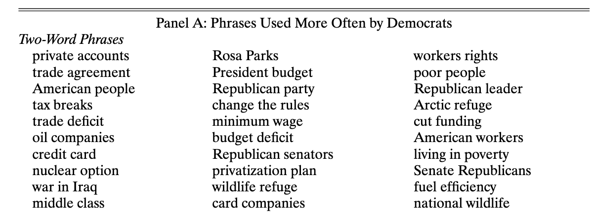
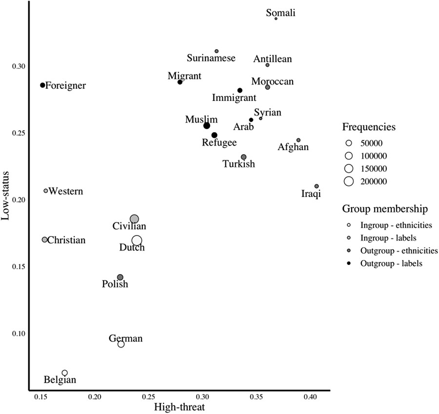
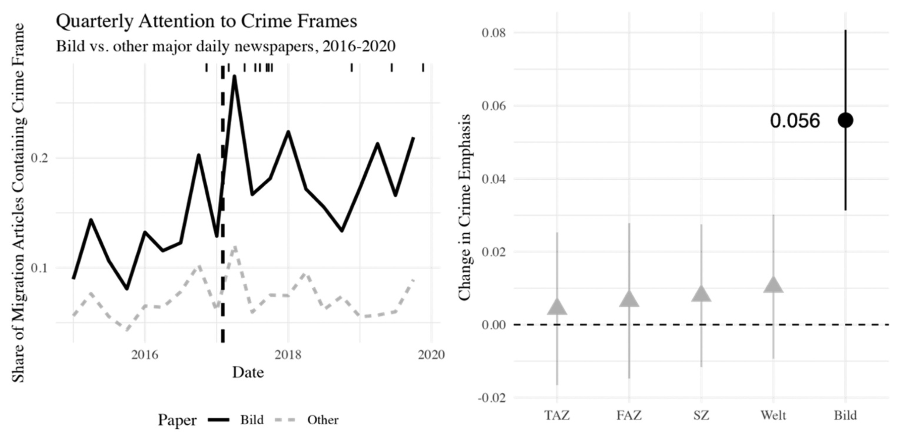

# Introductions

## Hi, my name is Nico

- Postdoc at ETH Public Policy Group & IPL
- Main focus: media and democracy
- Working a lot with political text, especially news & online comments
- Research areas:
  - Effects of media framing
  - Content moderation and hate speech
  - Media pluralism & democratic backsliding
- Heavy use of NLP & LLMs in all areas

## And you?

 

#### Please introduce yourself:

- What is your name and affiliation?
- What are your research interests?
- What is your interest in NLP/LLMs?

# Motivation

## Why Natural Language Processing (NLP)?

### Social interactions happen through text:

- Political campaigns
- Legislation
- News articles
- Social media interactions
- ...

## Why NLP?

 

- Research questions often require measurement from millions of documents
- Reading & annotating would take a lifetime
- Our (or our RA's) definitions might be inconsistent
- Not a great use of our time

. . .

### We need scalable methods!

## Examples

 

## Examples

## Examples

## Summary

 

- NLP methods offer powerful ways to study language at scale
- Many different methods and tasks
- Focus of this course:
  - Text representation (today)
  - Machine learning (tomorrow)
  - Transformer models (tomorrow & Friday)

# Course Overview

## NLP? I signed up for LLMs!

 

- LLMs are highly complex
- Intuition about them requires understanding of text representation, embeddings, and machine learning
- Course introduces each
- These methods are powerful in their own right
- We will also cover use of LLMs

## Your background

## Your background

## Your background

## Your preferences

## Your preferences (selection)

### Measurement

- *"identifying latent and subtle concepts in text"*; *"abstract concepts"*
- *"detect topics and emotions"*
- *"how to work with framing using NLP"*; *"LLM for framing analyses"*; *"long term framing analyses"*
- *"Stance detection"*; *"scoring positions"*

## Your preferences (selection)

### Practical/Technical Knowledge

- *"API"*, *"API"*, *"API"*, *"API"*
- *"validation"*
- *"reproducibility"* *"reliable"*
- *"workflow for huggingface library"*
- *"word embeddings"*

## Course Structure

::: callout-tip

### Today

#### Now: Intro to Python

#### Later: Text Representation

#### Pre-lunch: Embeddings

#### Post-lunch: Intro to Supervised Machine Learning

#### Afternoon:  *Inaugural lecture Christian von Sikorski*

:::
::: {.callout-important .fragment}

### Tomorrow

#### Morning: Intro to Transformer Models

#### Pre-lunch: Generative Transformers

#### Post-lunch: Using LLMs in your Research

#### If time: Practical Tools for Research

:::

## Course Structure and Conduct

- Each session consists of a lecture and a hands-on coding tutorial.
- <mark>Collaborate</mark> on coding problems!
- <mark>Use of AI is explicitly encouraged</mark>
- Please ask lots of questions & interrupt me!
- <mark>Be nice!</mark>

## Course Materials

Only relevant source: [github.com/nicolaiberk/llm_ws](https://github.com/nicolaiberk/llm_ws)

### Contains

- Syllabus
- Links to slides
- Notebooks for each session
- Additional materials

# Intro to Python

## Why Python?

 

- Python is a versatile programming language with many, many applications.
- Simple syntax, versatile tool.
- Less statistics focus than R (more 'practical')
- Rich ecosystem of libraries for text processing, machine learning, and LLMs.

::: {.absolute right=0 bottom=0}

:::

## Google Colab

 

- You can download python and use it locally on your computer
- But simpler if we all use the same (better) infrastructure
- [Google Colab](https://colab.research.google.com/) is a free cloud service where we can execute python code.
- Crucial: provides access to GPUs for training LLMs.

# Tutorial I

Intro to Colab & Python Basics

[Notebook](https://colab.research.google.com/github/nicolaiberk/llm_ws/blob/main/notebooks/01a_python.ipynb)

## Resources