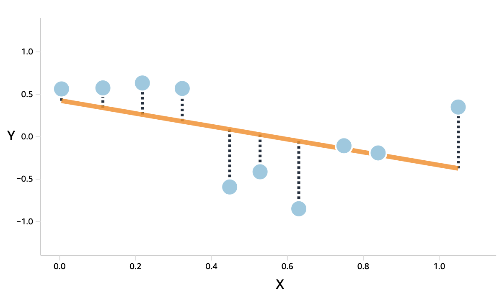

## Recap: Text Representation

<br>

- Capture Semantic Meaning with Embeddings
- Document Representations:
  - Bag of Words (BoW)
  - Term Frequency-Inverse Document Frequency (TF-IDF)
  - Document Embeddings

. . .

#### Today: how can we use these representations to measure concepts of interest?

## Today

<br>

- The basics of supervised machine learning
- Model evaluation
- Model selection

## Examples

<br>


## Examples

)](vis/ipl_geomatch.png)


## Examples


## ML Overview

<br>

#### Many different forms:


- Regression
- Classification
- Clustering/Unsupervised ML
- Generative Models

<br>

### Focus here on classification/supervised ML!

------------------------------------------------------------------------

<br>


### Supervised learning (A **very** precise definition):

<br> <br>

> We know stuff about some documents and want to know the same stuff about other documents.

#### Core Challenge: Prediction

## How to get there

#### (and what's a model?)

<br><br>

::: {style="display: flex; align-items: center; justify-content: center; gap: 0.6em; font-size: 1.6em; margin-top: 0.5em;"}
[Input]{style="padding: 0.5em 1em; border: 3px solid #444; border-radius: 10px;"}
[→]{style="font-size: 1.3em;"}
[Model]{style="padding: 0.5em 1em; border: 3px solid #444; border-radius: 50px; background: #ccff00;"}
[→]{style="font-size: 1.3em;"}
[Prediction]{style="padding: 0.5em 1em; border: 3px solid #444; border-radius: 10px;"}
:::

<br>

::: fragment
**Note**: the precise form of the model is not important. It is simply a <mark>function that takes input and produces output</mark>.
:::


## Some Lingo

<br>

| Term | Meaning |
|:-----------------|:-----------------------------------------------------|
| **Classifier** | a statistical model fitted to some data to make predictions about different data. |
| **Training** | The process of fitting the classifier to the data. |
| **Train and test set** | Datasets used to train and evaluate the classifier. |
| **Vectorizer** | A tool used to translate text into numbers. |

## Prediction, not Explanation

<br>

:::: columns
::: {.column width="50%"}
::: {.callout-note}

### Quantitative Analysis

- **Goal**:         Explanation - understand phenomena.
- **Model**:        Should describe reality accurately.
- **Focus**:        Interpretation of coefficients.
- **Example**:      Understanding the effect of education on income.

:::
:::
::: {.column width="50%"}
::: {.callout-important .fragment}

### Machine Learning

- **Goal**:       Prediction - make statements about unseen data.
- **Model**:      Model can be misspecified, as long as it predicts well.
- **Focus**:      Accuracy of predictions.
- **Example**:    Predicting email spam.

:::
:::
::::

<br>

::: fragment

### We might use the same method, but the goal is different!

:::


## The Classic Pipeline for Text Classification

<br>

::: incremental
0.  Annotate subset.
1.  Divide into training- and test-set.
2.  Transform text into numerical features.
3.  Fit model.
4.  Predict.
5.  Evaluate.
:::

. . .

{.absolute bottom="130" right="250" height="100"}


# The Classic Pipeline

## 0. Annotation

<br>

-   We need data from which to learn.
-   Assign labels to documents.
-   **Usually** randomly sampled.


## 0. Annotation


## 1. Divide into train and test (and val)

<br>

- Usually randomly sampled (not always!)
- Customary: 90-10/80-10-10 split
- Only consideration for test/validation set size: precision of metrics
- For large datasets 10% split not sensible, for small datasets 10% might be too small.

::: fragment

Check out Paco Tomas-Valiente's [testsampler package](https://github.com/pacotvj99/testsampleR) (forthcoming Political Analysis) on optimal test set selection.

:::

## 2. Transformation

<br>

Statistical models can only read numbers

$\rightarrow$ we need to **translate!**

. . .

### Classic DFM

::::: columns
::: {.column width="50%"}
| ID  | Text            |
|-----|-----------------|
| 1   | This is a text  |
| 2   | This is no text |
:::

::: {.column width="50%"}
| ID  | This | is  | a   | text | no  |
|-----|------|-----|-----|------|-----|
| 1   | 1    | 1   | 1   | 1    | 0   |
| 2   | 1    | 1   | 0   | 1    | 1   |
:::
:::::

## 3. Fit model.

<br>

::: incremental

- Many different models: OLS, logistic regression
- Other common models: Naïve Bayes, SVM, XGBoost

:::

. . .

### Not delving into different models today!

## 4. Predict.

### Use trained model to generate labels for unlabeled cases.

```{r}
library(dplyr)

data.frame(
  review = c("great movie!", 
             "what a bunch of cr*p",
             "I lost all faith in humanity after watching this"),
  label = c("?", "?", "?")
) %>% 
  knitr::kable()

```

## 5. Evaluation

<br>

### Confusion Matrix

```{r confusion}

actual <- as.logical(rbinom(1000, 1, 0.3))
pred <- actual
pred[sample(1:1000, 50)] <- F
pred[sample(1:1000, 50)] <- T

knitr::kable(table(pred, actual))

```

## 5. Evaluation {.smaller}

::::: columns
::: {.column width="30%"}

:::

::: {.column width="70%"}
<br>

| Term          | Meaning                                      |
|:--------------|:---------------------------------------------|
| **Accuracy**  | How much does it get right overall?          |
| **Recall**    | How much of the relevant cases does it find? |
| **Precision** | How many of the found cases are relevant?    |
| **F1 Score**  | Weighted average of precision and recall.    |
:::
:::::

## Issues with Common Metrics

```{r acc}

library(tidyverse)

base_rate <- seq(0, 1, 0.01)

accuracy <- function(base_rate, pred_rate) {
    (base_rate * pred_rate + (1 - base_rate) * (1 - pred_rate)) /
        (base_rate * pred_rate + (1 - base_rate) * (1 - pred_rate) + (1 - base_rate) * pred_rate + base_rate * (1 - pred_rate))
}

df <- expand.grid(base_rate = base_rate)
df$pred_rate <- ifelse(df$base_rate > 0.5, 1, 0)
df$accuracy <- accuracy(df$base_rate, df$pred_rate)

ggplot(df, aes(x = base_rate)) +
    geom_line(aes(y = accuracy)) +
    labs(title = "Accuracy of uninformative classifier as a function of prevalence",
         x = "Prevalence",
         y = "Accuracy") +
    theme_minimal()

```

::: aside
Optimal random guess is majority class
:::


## Issues with Common Metrics

```{r prf}

precision <- function(base_rate, pred_rate) {
    (base_rate * pred_rate) / ((base_rate*pred_rate) + ((1 - base_rate) * pred_rate))
}

recall <- function(base_rate, pred_rate) {
    (base_rate*pred_rate) / (base_rate * pred_rate + base_rate * (1 - pred_rate))
}

f1 <- function(base_rate, pred_rate) {
    2 * precision(base_rate, pred_rate) * recall(base_rate, pred_rate) / (precision(base_rate, pred_rate) + recall(base_rate, pred_rate))
}

f1_macro <- function(base_rate, pred_rate) {
    f1_pos <- f1(base_rate, pred_rate)
    f1_neg <- f1(1 - base_rate, 1 - pred_rate)
    (f1_pos + f1_neg) / 2
}

f1_wtd <- function(base_rate, pred_rate) {
    f1_pos <- f1(base_rate, pred_rate)
    f1_neg <- f1(1 - base_rate, 1 - pred_rate)
    (base_rate * f1_pos + (1 - base_rate) * f1_neg)
}

df <- expand.grid(base_rate = base_rate, pred_rate = seq(0.5, 1, 0.25))

df$Precision <- precision(df$base_rate, df$pred_rate)
df$Recall <- recall(df$base_rate, df$pred_rate)
df$F1 <- f1(df$base_rate, df$pred_rate)

df %>%
    pivot_longer(
        cols = c(Precision, Recall, F1), 
        names_to = "metric", values_to = "value"
        ) %>%
    ggplot(aes(x = base_rate, y = value)) +
    geom_line(aes(color = metric)) +
    labs(title = "Metrics as a Function of Outcome and Prediction Prevalence",
         x = "Prevalence",
         y = "Prediction Rate") +
    theme_minimal() +
    theme(legend.position = "None") +
    facet_grid(pred_rate~metric)

```


## Issues with Common Metrics


```{r f1adv}

df <- expand.grid(base_rate = base_rate, pred_rate = seq(0.1, 0.9, 0.1))

df$`F1 macro` <- f1_macro(df$base_rate, df$pred_rate)
df$`F1 weighted` <- f1_wtd(df$base_rate, df$pred_rate)

df %>%
    pivot_longer(
        cols = c(`F1 macro`, `F1 weighted`), 
        names_to = "metric", values_to = "value"
        ) %>%
    ggplot(aes(x = base_rate, y = value, group = pred_rate)) +
    geom_line(aes(color = pred_rate)) +
    labs(title = "F1 Macro and F1 Weighted as a Function of Outcome and Prediction Prevalence",
         x = "Prevalence",
         y = "Value") +
    theme_minimal() +
    facet_grid(~metric)

```


## Best Practice Evaluation

::: incremental

- Compare against informative baselines
  - Random prediction at prevalence rate
  - Compare classifiers of varying complexity
- Think about metric of interest (cancer detection vs. ad targeting)
- Use prevalence-insensitive metrics:
  - Matthew's correlation coefficient (MCC)
  - Youden's J/Bookmakers informedness (BM)

:::

::: fragment

### More on validation tomorrow!

:::

# Tutorial

🧑‍💻 [Tutorial: Training a simple text classifier](https://colab.research.google.com/github/nicolaiberk/Imbalanced/blob/master/01_IntroSML_Solution.ipynb)


# The perfect fit

## The Signal and the Noise

<br>

$$DGP: f(x) + \epsilon$$

<br>

::: fragment

> $f(x)$: the underlying function that describes the true relationship of the outcome variable $y$ with the predictor variable $x$.

> $\epsilon$: random deviation of a realized observation from this underlying function (noise).

:::

## Mean Squared Error




$$MSE = \frac{1}{n} \sum_{i=1}^{n} (y_i - \hat{y}_i)^2$$

> deviation of the predicted value $\hat{y}_i$ from the realized observation $y_i$.


## Error decomposition

<br>

$$MSE = \underbrace{(E[\hat{f}(x)]-f(x))^2}_{\text{expected prediction - expected truth (bias)}} + \\
\underbrace{E[(\hat{f}(x)-E[\hat{f}(x)])^2]}_{\text{individual prediction - expected prediction (variance)}} + \\
\underbrace{E[(y-f(x))^2]}_{\text{realised observation - expected truth (noise)}}$$


## What is an `<mark-cyan>expected prediction</mark-cyan>'?

> Noise creates variation in realized observations. If we fit a model to many different samples, we will get different predictions for the same $x$.

```{r}
#| fig-width: 6.25
#| fig-height: 4.17
#| fig-align: "center"

set.seed(123)
library(tidyverse)

n_obs <- 25

dta <- data.frame(
    x = rnorm(n_obs)
) %>% 
mutate(
    y_true = 2 - 1.5 * x^2 + 1.5 * x
)

sampler_y <- function(dta, n_obs = 25) {
    y_real <- dta$y_true + 2 * rnorm(n_obs)
    return(y_real)
}

fit_and_predict <- function(dta, y_col, poly = 1) {
    fit <- lm(as.formula(paste(y_col, "~ poly(x, ", poly, ")")), data = dta)
    dta[[paste0("yhat", gsub("yreal", "", y_col))]] <- predict(fit, newdata = dta)
    return(dta)
}

for (i in 1:10) {
    dta[[paste0("yreal", i)]] <- sampler_y(dta, n_obs = n_obs)
    dta <- fit_and_predict(dta, paste0("yreal", i))
}

dta$mean_yhat <- rowMeans(dta[, paste0("yhat", 1:10)])


dta %>% 
    ggplot(aes(x = x, y = yreal1)) +
    geom_point() +
    geom_smooth(method = "lm", formula = y ~ x, se = FALSE) +
    labs(title = "",
         x = "Predictor (x)",
         y = "Outcome (y)") +
    theme_minimal() +
    ylim(c(-5, 5)) + xlim(c(-2, 2))

```

## What is an `<mark-cyan>expected prediction</mark-cyan>'?

> Noise creates variation in realized observations. If we fit a model to many different samples, we will get different predictions for the same $x$.

```{r}
#| fig-width: 6.25
#| fig-height: 4.17
#| fig-align: "center"

dta %>% 
    ggplot(aes(x = x, y = yreal2)) +
    geom_point() +
    geom_smooth(aes(y = yreal1), method = "lm", formula = y ~ x, se = FALSE, color = "gray") +
    geom_smooth(method = "lm", formula = y ~ x, se = FALSE) +
    labs(title = "",
         x = "Predictor (x)",
         y = "Outcome (y)") +
    theme_minimal()

```

## What is an `<mark-cyan>expected prediction</mark-cyan>'?

> Noise creates variation in realized observations. If we fit a model to many different samples, we will get different predictions for the same $x$.

```{r}
#| fig-width: 6.25
#| fig-height: 4.17
#| fig-align: "center"

dta %>% 
    ggplot(aes(x = x, y = yreal3)) +
    geom_point() +
    geom_smooth(aes(y = yreal1), method = "lm", formula = y ~ x, se = FALSE, color = "gray") +
    geom_smooth(aes(y = yreal2), method = "lm", formula = y ~ x, se = FALSE, color = "gray") +
    geom_smooth(method = "lm", formula = y ~ x, se = FALSE) +
    labs(title = "",
         x = "Predictor (x)",
         y = "Outcome (y)") +
    theme_minimal()

```

## Variance

$Var(f(x)) = E[($<mark-gray>$f(x)$</mark-gray> - <mark-cyan>$E[f(x)]$</mark-cyan>$)^2]$

> Difference between <mark-gray>individual predictions</mark-gray> and the <mark-cyan>expected prediction of our model</mark-cyan>.

```{r}
#| fig-width: 6.25
#| fig-height: 4.17
#| fig-align: "center"

dta %>% 
    ggplot(aes(x = x)) +
    geom_smooth(aes(y = yhat1), method = "lm", formula = y ~ x, se = FALSE, color = "gray") +
    geom_smooth(aes(y = yhat2), method = "lm", formula = y ~ x, se = FALSE, color = "gray") +
    geom_smooth(aes(y = yhat3), method = "lm", formula = y ~ x, se = FALSE, color = "gray") +
    geom_smooth(aes(y = yhat4), method = "lm", formula = y ~ x, se = FALSE, color = "gray") +
    geom_smooth(aes(y = yhat5), method = "lm", formula = y ~ x, se = FALSE, color = "gray") +
    geom_smooth(aes(y = yhat6), method = "lm", formula = y ~ x, se = FALSE, color = "gray") +
    geom_smooth(aes(y = yhat7), method = "lm", formula = y ~ x, se = FALSE, color = "gray") +
    geom_smooth(aes(y = yhat8), method = "lm", formula = y ~ x, se = FALSE, color = "gray") +
    geom_smooth(aes(y = yhat9), method = "lm", formula = y ~ x, se = FALSE, color = "gray") +
    geom_smooth(aes(y = yhat10), method = "lm", formula = y ~ x, se = FALSE, color = "gray") +
    geom_smooth(aes(y = mean_yhat), method = "lm", formula = y ~ x, se = FALSE, color = "cyan", lwd = 1.5) +
    labs(title = "",
         x = "Predictor (x)",
         y = "Outcome (y)") +
    theme_minimal()

```

## Bias

$Bias^2(x)=($<mark-cyan>$E[\hat{f}​(x)]$</mark-cyan>$-$<mark>$f(x)$</mark>$)^2$

> Difference between the <mark-cyan>expected prediction of our model</mark-cyan> and <mark>average realized value</mark> (no noise)

```{r}
#| fig-width: 6.25
#| fig-height: 4.17
#| fig-align: "center"

dta %>% 
    ggplot(aes(x = x)) +
    geom_point(aes(y = y_true), color = "#ccff00") +
    geom_smooth(aes(y = y_true), method = "lm", formula = y ~ poly(x, 2), se = FALSE, color = "#ccff00", lwd = .5) +
    geom_smooth(aes(y = mean_yhat), method = "lm", formula = y ~ x, se = FALSE, color = "cyan") +
    labs(title = "",
         x = "Predictor (x)",
         y = "Outcome (y)") +
    theme_minimal()

```

## Underfitting

> The model is too simple to capture the underlying data generating process.

::: columns
::: column

```{r}
#| fig-width: 5
#| fig-height: 5
#| fig-align: "center"

dta %>% 
    ggplot(aes(x = x)) +
    geom_smooth(aes(y = yreal1), method = "lm", formula = y ~ x, se = FALSE, color = "gray") +
    geom_smooth(aes(y = yreal2), method = "lm", formula = y ~ x, se = FALSE, color = "gray") +
    geom_smooth(aes(y = yreal3), method = "lm", formula = y ~ x, se = FALSE, color = "gray") +
    geom_smooth(aes(y = yreal4), method = "lm", formula = y ~ x, se = FALSE, color = "gray") +
    geom_smooth(aes(y = yreal5), method = "lm", formula = y ~ x, se = FALSE, color = "gray") +
    geom_smooth(aes(y = yreal6), method = "lm", formula = y ~ x, se = FALSE, color = "gray") +
    geom_smooth(aes(y = yreal7), method = "lm", formula = y ~ x, se = FALSE, color = "gray") +
    geom_smooth(aes(y = yreal8), method = "lm", formula = y ~ x, se = FALSE, color = "gray") +
    geom_smooth(aes(y = yreal9), method = "lm", formula = y ~ x, se = FALSE, color = "gray") +
    geom_smooth(aes(y = yreal10), method = "lm", formula = y ~ x, se = FALSE, color = "gray") +
    geom_smooth(aes(y = mean_yhat), method = "lm", formula = y ~ x, se = FALSE, color = "cyan", lwd = 1.5) +
    geom_point(aes(y = y_true), color = "#ccff00") +
    geom_smooth(aes(y = y_true), method = "lm", formula = y ~ poly(x, 2), se = FALSE, color = "#ccff00", lwd = .5) +
    labs(title = "",
         x = "Predictor (x)",
         y = "Outcome (y)") +
    theme_minimal()

```

:::
::: {.column .fragment}

### Comes with 

- high bias
- low variance.

<br>

::: fragment

#### What happens when we increase model complexity?

:::
:::
:::


## Overfitting

```{r}

dta <- data.frame(
    x = rnorm(n_obs)
) %>% 
mutate(
    y_true = 2 - 1.5 * x^2 + 1.5 * x
)

for (i in 1:10) {
    dta[[paste0("yreal", i)]] <- sampler_y(dta, n_obs = n_obs)
    dta <- fit_and_predict(dta, paste0("yreal", i), poly = 5)
}

dta$mean_yhat <- rowMeans(dta[, paste0("yhat", 1:10)])

dta %>% 
    ggplot(aes(x = x)) +
    geom_smooth(aes(y = yreal1), method = "lm", formula = y ~ poly(x, 8), se = FALSE, color = "gray") + 
    geom_smooth(aes(y = yreal2), method = "lm", formula = y ~ poly(x, 8), se = FALSE, color = "gray") + 
    geom_smooth(aes(y = yreal3), method = "lm", formula = y ~ poly(x, 8), se = FALSE, color = "gray") + 
    geom_smooth(aes(y = yreal4), method = "lm", formula = y ~ poly(x, 8), se = FALSE, color = "gray") + 
    geom_smooth(aes(y = yreal5), method = "lm", formula = y ~ poly(x, 8), se = FALSE, color = "gray") + 
    geom_smooth(aes(y = yreal6), method = "lm", formula = y ~ poly(x, 8), se = FALSE, color = "gray") + 
    geom_smooth(aes(y = yreal7), method = "lm", formula = y ~ poly(x, 8), se = FALSE, color = "gray") + 
    geom_smooth(aes(y = yreal8), method = "lm", formula = y ~ poly(x, 8), se = FALSE, color = "gray") + 
    geom_smooth(aes(y = yreal9), method = "lm", formula = y ~ poly(x, 8), se = FALSE, color = "gray") + 
    geom_smooth(aes(y = yreal10), method = "lm", formula = y ~ poly(x, 8), se = FALSE, color = "gray") + 
    geom_smooth(aes(y = y_true, color = "True DGP"), method = "lm", formula = y ~ poly(x, 2), se = FALSE, lwd = 1.5) +
    geom_line(aes(y = mean_yhat, color = "Mean Prediction"), lwd = 1.5) +
    labs(title = "",
         x = "Predictor (x)",
         y = "Outcome (y)",
         color = "") +
    scale_color_manual(values = c("True DGP" = "#ccff00", "Mean Prediction" = "cyan")) +
    theme_minimal() +
    theme(legend.position = "bottom")

```

## Overfitting

<br><br>

### Too complex models lead to <mark>overfitting</mark>, resulting in

- oversensitive predictions 
- that do not generalize well to new data
- $\rightarrow$ <mark>high variance, low bias<mark>

<br>

## The Bias-Variance <mark>Tradeoff</mark>


](vis/bvt.png)

### The art of machine learning is to find the right balance between bias and variance/under- and overfitting.


## Classic ML vs. LLMs

<br>

::: columns
::: {.column .callout-note .incremental}

### Advantages of 'simple' ML using bag-of-words

- <mark>Interpretable</mark>: which words are predictive?
- Fast & <mark>efficient</mark> to train and predict
- (Can be trained on <mark>small data</mark>sets)

:::
::: {.column .callout-important .fragment .incremental}

### Disadvantages compared to LLMs


- <mark>No semantic understanding</mark> of text
- <mark>Worse performance</mark> on large data
- <mark>Task-specific</mark>, not generalizable

::: 
::::

# Break