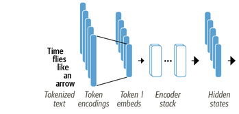
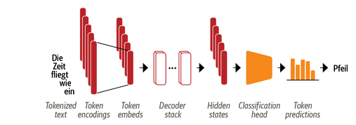
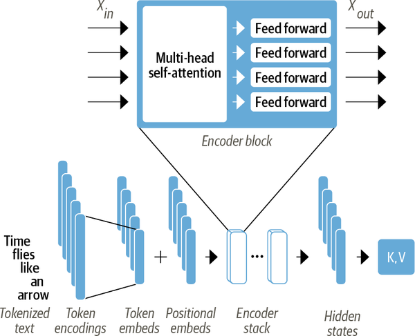
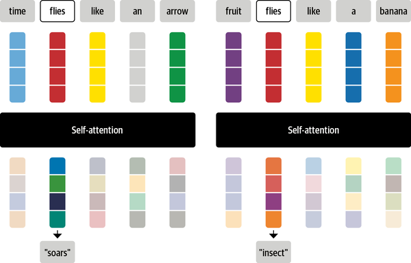
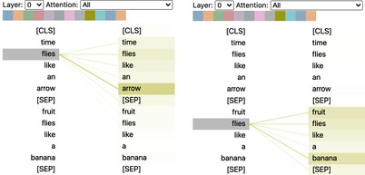

## Some terminology

::: callout-note

### Encoder (e.g. BERT)

:::: columns
::: column

- Converts an input sequence of tokens into a sequence of embedding vectors
- Trained on masked language modeling
- Tasks: Text classification, named entity recognition, question answering, ...

:::
::: column



:::
::::
:::

::: fragment
::: callout-important

### Decoder (e.g. GPT)

:::: columns
::: column

- Uses a sequence of embedding vectors to iteratively generate an output sequence of tokens, one token at a time
- Trained to predict next word
- Tasks: Mainly text **generation** (e.g. Chatbot responses)

:::
::: column



:::
::::
:::
:::

## Transformers Overview


## The Encoder Architecture (e.g. BERT)



# Tokenization in LLMs

## Issues with simple word tokenization

<br>

### Consider the following words:

"national", "nationalism", "nationalist", "nationalize"

#### What are potential issues with simple word tokenization here?


::: fragment

<br>

### Any ideas how to solve these issues?

:::

## Solution: Subword Tokenization

](vis/subword_tokenization.png)

#### Which advantages do you see with subword tokenization?


## How does it work? (roughly)

1. Start with small vocabulary of characters and special tokens
2. Map them in the training data (e.g. "w ##o ##r ##d")
3. Combine most frequent pairs or unexpectedly frequent ones, given constitutive terms
4. Stop when you reach your desired vocabulary size

::: {.callout-important .fragment}
### Note that this works better for some languages than for others
:::

::: aside
More: 🤗 Course [Ch.5](https://huggingface.co/learn/llm-course/en/chapter6/5) and [Ch.6](https://huggingface.co/learn/llm-course/en/chapter6/6)
:::

## Special Tokens

<br>

- `[CLS]`: Represents the entire input sequence
- `[SEP]`: Separates different segments of text
- `[PAD]`: Used for padding sequences to the same length
- `[UNK]`: Represents unknown or out-of-vocabulary words
- `[MASK]`: Used for masked language modeling tasks

## The Encoder Architecture (e.g. BERT)


## Encoder Block

](vis/encoder_block.png)

# Contextualized Embeddings

## Issues with Classic Embeddings

```{r}

library(ggplot2)
library(dplyr)

data.frame(
  word = c("flies", "glides", "soars", "insects", "bugs"),
  x = c(0.5, 0.1, 0.2, 0.8, 0.9),
  y = c(0.6, 0.25, 0.3, 0.9, 0.8),
  col = c("blue", "green", "green", "red", "red")
) %>% 
  ggplot(aes(x, y, label = word, color = col)) +
  geom_label() +
  xlim(0, 1) + ylim(0, 1) +
  theme_void() +
  theme(legend.position = "none")

```

::: aside

The following slides are based @tunstall2022natural, Ch.2.

:::

## Issues with Classic Embeddings

### Contextual Meaning

<br>

### Sentence a: Time *flies* like an arrow

vs.

### Sentence b: Fruit *flies* like a banana

::: fragment

<br>

### How could we represent the different meanings?

:::

## Contextualized Embeddings

```{r}

library(ggplot2)
library(dplyr)

data.frame(
  word = c("flies (a)", "flies (b)", "glides", "soars", "insects", "bugs"),
  x = c(0.3, 0.75, 0.1, 0.2, 0.8, 0.9),
  y = c(0.35, 0.75, 0.25, 0.3, 0.9, 0.8),
  col = c("lightgreen", "lightred", "green", "green", "red", "red")
) %>% 
  ggplot(aes(x, y, label = word, color = col)) +
  geom_label() +
  xlim(0, 1) + ylim(0, 1) +
  theme_void() +
  theme(legend.position = "none")

```

## Contextualized Embeddings

### Contextual Meaning

<br>

### Sentence a: Time *flies* like an arrow

vs.

### Sentence b: Fruit *flies* like a banana

::: fragment

<br>

### How do *you* infer the different meanings?

:::

## Attention Mechanism: Intuition



## Solution: Weighted Average

$$x'_i = \sum_{j=1}^{n} w_{ij} x_j$$

> **Weighted average** of all input embeddings

- $x'_i$: Contextualized embedding of token $i$
- $x_j$: Embedding of token $j$
- $w_{ij}$: Attention weight for token $j$ with respect to token $i$
- $n$: Number of tokens in the input sequence

## Attention Mechanism: Example



## Positional Encodings

<br>

- We can also capture the **position** of each token in the sequence
- Similar approach:
  - Create a vector for each position in the sequence
  - Add these vectors to the token embeddings
  - This allows the model to understand the order of tokens

# From Embedding to Classification

## Classification Heads

](vis/encoder_simple.svg)

## Classification Heads

#### Many Tasks, One Model

- Sequence Classification
- Masked Language Modeling
- Multiple Choice
- Token Classification
- Question Answering

# Tutorial

**Tokenization and Inference**

[Notebook](https://colab.research.google.com/github/nicolaiberk/llm_ws/blob/main/notebooks/04b_finetuning_bert.ipynb)


## Resources {.uncounted}


