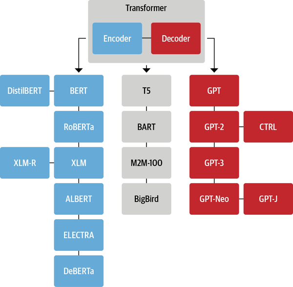
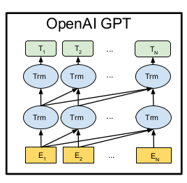
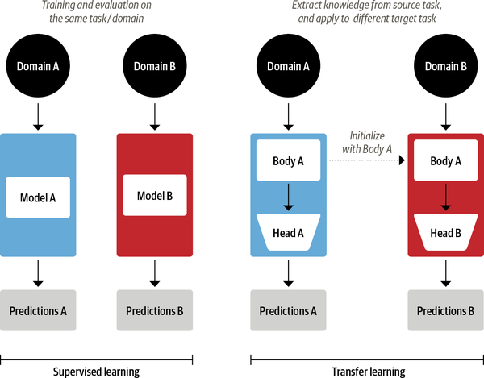
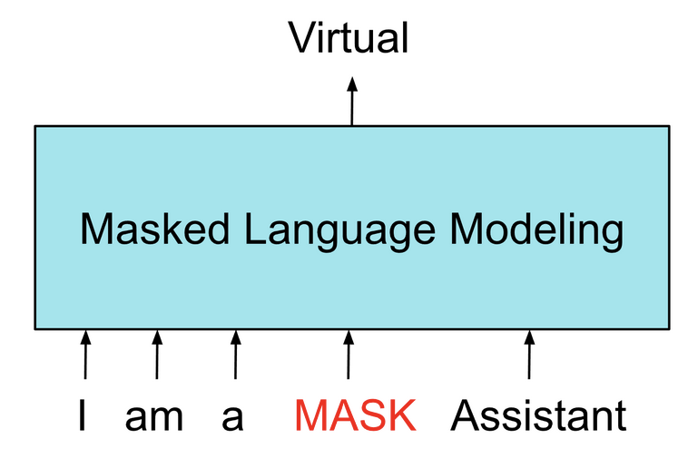
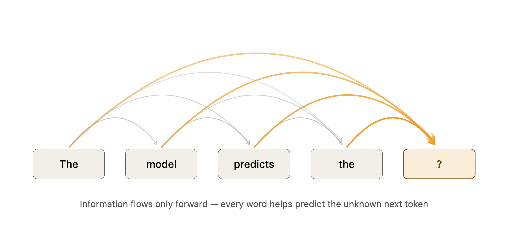

## Recap: Decoder vs. Encoder



## Recap: Decoder vs. Encoder

::: callout-note

### Encoder (e.g. BERT)

:::: columns
::: column

- Converts an input sequence of tokens into a sequence of embedding vectors
- Trained on masked language modeling
- Tasks: Text classification, named entity recognition, question answering, ...

:::
::: column


:::
::::
:::

::: fragment
::: callout-important

### Decoder (e.g. GPT)

:::: columns
::: column

- Uses a sequence of embedding vectors to iteratively generate an output sequence of tokens, one token at a time
- Trained to predict next word
- Tasks: Mainly text **generation** (e.g. Chatbot responses)

:::
::: column


:::
::::
:::
:::


# The Decoder


## How a Decoder Works {auto-animate="true"}

<br>


## How a Decoder Works {auto-animate="true"}


- Input: "Cause and..."
- **Predicts next token**: "effect"
- Repeats until stopping condition
- *Autoregressive* generation

#### "Causal" language modeling


## Major differences

<br>

::: columns
::: column

- **Autoregressive**: Generates one word at a time
- **"Causal" attention**: Only looks at previous words
- **Massive scale**: Often billions of parameters

:::
::: column



:::
:::

## What does this look like?

<br><br>

### [Visualization](https://poloclub.github.io/transformer-explainer/)

Take 5-10 minutes to explore the visualization and discuss with your neighbor how the transformer architecture works.

::: fragment

### Let's talk through it!

:::

## Decoder Tasks

- Content generation

. . .

### Surprisingly generalizable task!

- Zero/few-shot Classification
- Code generation
- Translation
- App development

...many more things it was not trained to do!

## Social Science applications

- Annotation
- Extraction/text-mining
- Generating experimental treatments
- Adaptive surveys
- Literature reviews
- Simulation of social behaviour?
- Policy simulation?

# Training LLMs

## What is "Training" ?

<br>

- Remember from ML course: **Training** is the process of optimizing a model's parameters on a specific task using labeled data.
- In regression framework, this is called **fitting** the model to the training data.

## Three Essential Steps

<br>

- **Forward pass**: The process of passing input data through the model to obtain predictions.
- **Loss**: A measure of how well the model's predictions match the ground truth.
- **Backward pass**: The process of updating model parameters based on the loss.

## Training Objective

> Training or fitting a model is the process of optimizing its parameters to predict the desired output.

::: incremental

- Basically the same as OLS, just with a different <mark>loss function</mark>.
- Loss functions depend on task.

:::

::: {.fragment .incremental}

### What is learned: parameters

- **Token embeddings**
- **Attention weights**: matrices that determine what to attend to.
- **Weights** in each layer of the neural network - the main action.
- Not learned: **hyperparameters**.

:::

## Three stages of LLM Training

<br><br>

::: incremental

1. **Pretraining**: Train on a large corpus of text to learn general language patterns.
2. **Fine-tuning**: Adapt the pretrained model to a specific task or domain.
3. **Additional Post-training** (optional): Further refine the model, e.g. to follow certain preferences.


:::

## Transfer Learning/Fine-Tuning




## Pre-Training Encoder Models

### Masked Language Modeling (MLM)

::: columns
::: column
::: incremental

- Training task used for encoder models
- Randomly masks a percentage of input tokens
- Model learns to predict the masked tokens based on context
- Bidirectional Attention: considers both left and right context

:::
:::
::: column


<br>



:::
:::

::: fragment

Output: probability distribution across tokens ("Virtual" (87%), "good" (8%), "helpful" (3%), ...)

:::

## Post-training Encoder Models

<br>

- Task-dependent
- For supervised classification: use [CLS] token embedding for classification to predict labels (=fine tuning)
- Other post-training: 
  - Add task-specific heads (e.g., for NER, etc.)
  - Continued pre-training for domain adaptation

## Pre-Training Decoder Models

### "Causal" Language Modeling (CLM)




- Predicts the next token in a sequence
- Unidirectional Attention: only considers previous tokens
- Same output as MLM: probability distribution across tokens

## Fine-Tuning Decoder Models

<br>

::: incremental

- Pre-training yields a next-token predictor of internet text.
- Post-training turns it into a model that <mark>follows instructions and refuses harmful requests</mark>.
- **Instruction tuning**: Train on (instruction, response) pairs. [Example dataset](https://huggingface.co/datasets/Anthropic/hh-rlhf/viewer/default/train?row=4)
- Models learn chat format and how to respond to instructions.

:::

## Chats: Cosplay for Generative LLMs

<br>

::: columns
::: column

### A typical chat structure

```
<|im_start|>system
You are a helpful assistant.<|im_end|>
<|im_start|>user
What is the capital of Switzerland?<|im_end|>
<|im_start|>assistant
The capital is Bern.<|im_end|>
<|im_start|>user
And its population?<|im_end|>
<|im_start|>assistant
```

:::
::: {.column .fragment}

### "Reasoning"

```
<|im_start|>assistant
<think>
The user asks about population. Bern city proper is ~135k,
the metro area larger. They probably mean the city...
</think>
Bern has roughly 135,000 inhabitants in the city proper.<|im_end|>
```

:::
:::


## Additional Post-Training

### Reinforcement Learning with Human Feedback (RLHF)

<br>

::: incremental

- Humans rank model outputs 
- Model optimized to produce outputs that align with human preferences
- Aiming for more helpful, less harmful, more truthful responses and a happy, sycophantic character (or sometimes a chinese party member)
- Also: RL with verifiable rewards (RLVR), like math answers or code

:::

## The Huggingface Ecosystem

<br>

### [The Model Hub](https://huggingface.co/models)

### [Datasets](https://huggingface.co/datasets)


# Tutorial: Generative LLMs

[Notebook](https://colab.research.google.com/github/nicolaiberk/llm_ws/blob/dimes26/notebooks/06_prompting.ipynb)


## Resources
