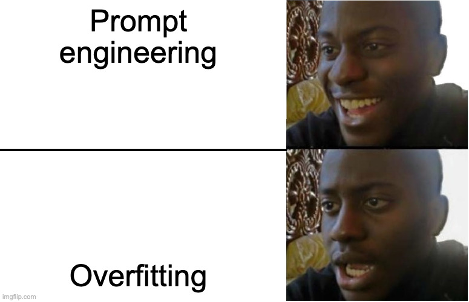
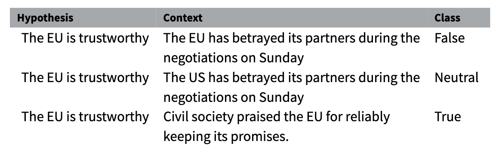
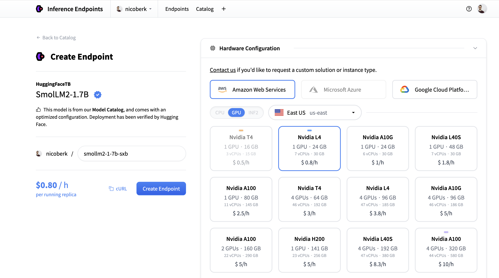
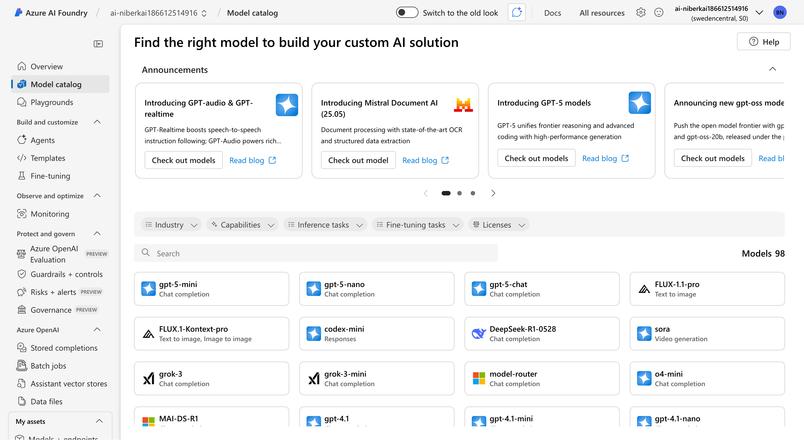
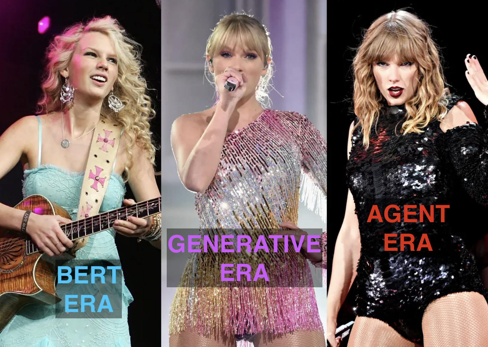

# Inference with LLMs

## Writing a good prompt

- <mark>Persona</mark>
- **Task**
- Context
- *Format*

<mark>You are a program manager in [industry].</mark> **Draft an executive summary email** to [persona] based on [details
about relevant program docs]. *Limit to bullet points.*

::: aside
[Google prompting guide](https://services.google.com/fh/files/misc/gemini-for-google-workspace-prompting-guide-101.pdf)
:::

## Prompting



#### <mark>A prompt is a hyperparameter</mark>

## Labelling with LLMs

<br>

- **Zero-shot**: just prompt provided
- **Few-shot**: a few examples provided
- **Dynamic few-shot**: examples selected based on similarity to the input

## Few-shot labelling example

<br>

```
Your task is to analyze the sentiment in the TEXT below from an investor perspective and label it with only one of the three labels:
positive, negative, or neutral.

Examples:
Text: Operating profit increased, from EUR 7m to 9m compared to the previous reporting period.
Label: positive
Text: The company generated net sales of 11.3 million euro this year.
Label: neutral
Text: Profit before taxes decreased to EUR 14m, compared to EUR 19m in the previous period.	
Label: negative
```

## Dynamic few-shot labelling

<br>

#### Idea: most similar examples should be most informative

1. Use cosine_similarity of embedding to assess similarity
2. Add k most similar examples to the prompt

## Retrieval Augmented Generation (RAG)

<br>

1. Retrieve most likely examples given a query (e.g. context for question)
2. [Optional: rerank generated examples using cross-encoder]
3. Use these examples in the prompt to generate an answer

Use-cases: archival research, chatbots, ...

## Synthetic Annotation

](https://huggingface.co/datasets/huggingface/documentation-images/resolve/main/blog/176_synthetic-data-save-costs/table_pros_cons.png)

## Synthetic Annotation

<br>

- Use LLM to annotate training data
- Generate synthetic labels
- Train smaller encoder model on synthetic data
- Evaluate on gold standard
- Apply cost-efficient at scale

## Zero-shot encoder models 

### @laurer2024less

- Task: natural-language inference (NLI) - universal
- Allow prompting
- Controlled output
- Class probabilities
- Efficient

::: fragment

#### Try this before using generative models

:::

## How does it work?

<br>



## How does it work?

<br>

-  Class-hypotheses: “It is about economy", "it is about democracy", ...
-  E.g. “We need to raise tariffs” as context
-  Test each of the class-hypotheses against this context
-  Probabilities for entailment and contradiction are converted to label probabilities

::: aside
[More](https://huggingface.co/tasks/zero-shot-classification)
:::


# Hosting

## [HF Inference Endpoints](https://endpoints.huggingface.co/)



## Local Hosting

### Ollama

<br>

```{python}
#| eval: false
#| echo: true

from ollama import chat
from ollama import ChatResponse

response: ChatResponse = chat(model='gemma3', messages=[
  {
    'role': 'user',
    'content': 'Why is the sky blue?',
  },
])
print(response['message']['content'])
# or access fields directly from the response object
print(response.message.content)
```


## OpenAI

<br>

```{python}
#| eval: false
#| echo: true

from openai import OpenAI
client = OpenAI()

response = client.responses.create(
    model="gpt-5",
    input="Write a short bedtime story about a unicorn."
)

print(response.output_text)
```


## Anthropic

```{python}
#| eval: false
#| echo: true
# pip install anthropic
import anthropic

client = anthropic.Anthropic(api_key="YOUR_API_KEY_HERE")

response = client.messages.create(
    model="claude-opus-4-8",
    max_tokens=16,
    messages=[
        {"role": "user", "content": "What is the capital of France?"}
    ]
)

print(response.content[0].text)
```

```{python}
#| echo: false

print("The capital of France is **Paris**.")

```


## [Azure](https://oai.azure.com)



# Controlling and Improving Model Output

## Structured Output

### [`pydantic`](https://docs.pydantic.dev/latest/concepts/models/#validating-data)

Let's you impose structure on model outputs.

```{python}
#| eval: false
#| echo: true

class CityLocation(BaseModel):
    city: str
    country: str


agent = Agent('google-gla:gemini-1.5-flash', output_type=CityLocation)
result = agent.run_sync('Where were the olympics held in 2012?')
print(result.output)
#> city='London' country='United Kingdom'
```


::: aside
::: fragment

#### See also

- [Ollama structured output](https://ollama.com/blog/structured-outputs)
- [OpenAI function calls](https://platform.openai.com/docs/guides/function-calling#defining-functions)

:::
:::


## Tool use




## Tool use

### Tools allow agents to <mark>interact</mark> with the world


#### Examples

- Web search (e.g., Bing, Google)
- Code Execution (e.g., Python, R, Bash)
- Database queries (e.g., SQL), APIs
- Slack, email, calendar, Notion, etc.
- ...

#### [Overview of Claude Tools](https://code.claude.com/docs/en/tools-reference)

::: aside

See also: [Skills](https://support.claude.com/en/articles/12512176-what-are-skills)

:::

## Tool use via API

<br>

```{python}
#| eval: false
#| echo: true

client = anthropic.Anthropic()
response = client.messages.create(
    model="claude-sonnet-5",
    max_tokens=1024,
    tools=[{"type": "web_search_20250305", "name": "web_search"}],
    messages=[{"role": "user", "content": "In one sentence, what's the latest on the Mars rover?"}],
)
print(response.content)

```

<br>

```{python}
#| echo: false

print("On June 14, 2026, NASA's Perseverance rover completed the equivalent of a marathon—26.2 miles (42.2 kilometers)—on Mars in just 5 years and 4 months, and the rover is still going strong.")

```

## Social Science Applications

<br>

::: fragment

- Basic Literature Review
- [Building Replication Packages](https://reproai.org/#overview)
- Agentic Code Review
- [Image Analysis](https://osf.io/preprints/osf/kmnr7_v1)
- Digitalization of Historical Sources
- [Automated maintenance of Basic Data Pipelines](https://nicolaiberk.com/posts/maintaining_pipelines_with_claude.html)

:::


# Tutorial

API calls, Structured Output

[Notebook](https://colab.research.google.com/github/nicolaiberk/llm_ws/blob/main/notebooks/05b_api.ipynb)


## Resources
