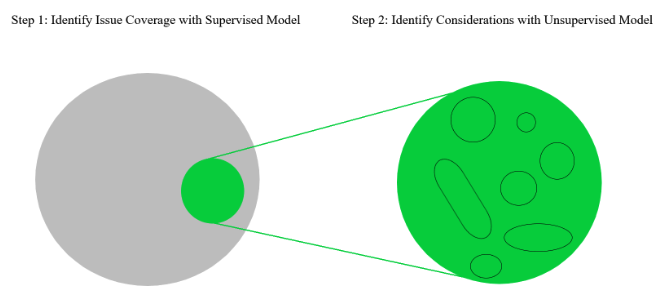
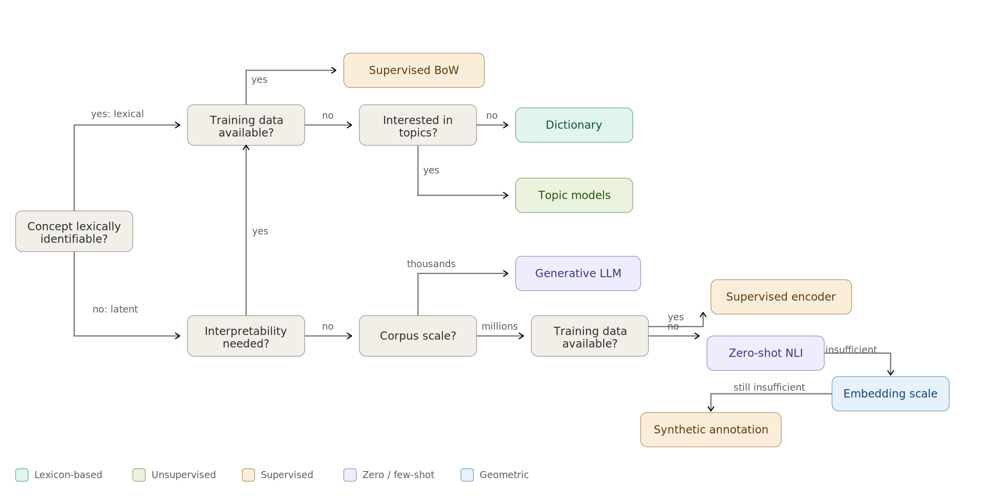

# From Concept to Measurement

## The measurement pipeline

 

1. **Concept**: what do you want to study?
2. **Conceptualization**: what *exactly* do you mean by it?
3. **Operationalization**: how does it show up in text?
4. **Measurement**: which tool extracts it?

 

::: fragment
#### <mark>The method comes last — not first</mark>
:::

# Case Study: Framing

## What is a frame?

 

> "To frame is to <mark>select some aspects of a perceived reality and make them more salient</mark> in a communicating text, in such a way as to promote a particular problem definition, causal interpretation, moral evaluation, and/or treatment recommendation." [@entman1993framing]

## Associative Framing in @schultz2012strategic

- Associative frames: "<mark>multiple connections between several concepts</mark>"
- Analyse several thousand news articles and press releases
- Method: 
  - Identification of concepts with keyword list
  - Frames measured as conditional probabilities: how likely that **b** will be discussed once **a** is discussed?

::: fragment

#### What alternative approaches to measure associative frames can you think of?

:::

## Emphasis Framing in @berk2025impact

 

- Frames are <mark>selected aspects of reality</mark>, which **encourage** certain problem definitions and causal interpretations
- Fine-tune BERT transformer models to identify migration and crime content
- "about 7% of all migration coverage consists of articles about some form of crime"

## Emphasis Framing in @berk2023framing

Same definition: frames as selected aspects of reality

#### Two-step measurement:

1. Issue coverage: supervised classifier 
2. Frame coverage: topic model (BERTopic) on issue coverage

## Emphasis Framing in @hase2021climate

 

Almost identical approach:

1. Retrieved all climate change-related articles with keywords
2. Structural topic model to identify attention to subtopics

 

::: fragment

### But they do not refer to these as 'frames', but topics!

:::

## What determines the choice?

 

- **Concept**: explicit or latent? categorical or continuous?
- **Data**: how much? labeled? sensitive?
- **Resources**: compute, budget, time
- **Requirements**: reproducibility, data protection, scale

## A simplistic decision tree

::: aside
Ideally use several methods to cross-validate your results.
:::

## Your Turn

  

**Work with your neighbor (pairs or groups of 3).** Discuss your own research and develop a measurement strategy for a concept of your choice. 

## Conceptualize

By yourself, **write down**:

1. **Name** your concept and **define** it in 1-2 sentences
2. What is your **unit of analysis**? (document, paragraph, sentence, speaker, ...)
3. Is the concept **categorical** (present/absent, A/B/C) or **continuous** (more/less)?
4. Write down a few examples 

::: fragment
When you're done, **discuss and refine** your answers with your neighbor.
:::

## Operationalize

**Data:**

1. What data would you like to analyse?
2. Roughly **how many** documents?

**Method** — use the decision tree:

8. Which method do you choose, and **why**? Refer to your answers from Round 1.
9. What does that method **require**? (labeled data? compute? budget? API access?)
10. Consider a **second choice** to cross-validate

# Shared Discussion

# Prototyping

Let's see what we can measure!

[Notebook](https://colab.research.google.com/github/nicolaiberk/llm_ws/blob/main/notebooks/08_application.ipynb)

## Resources