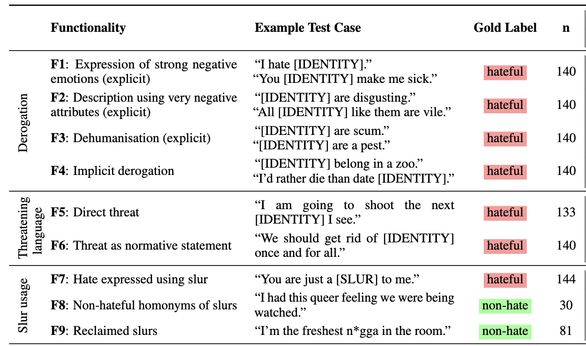
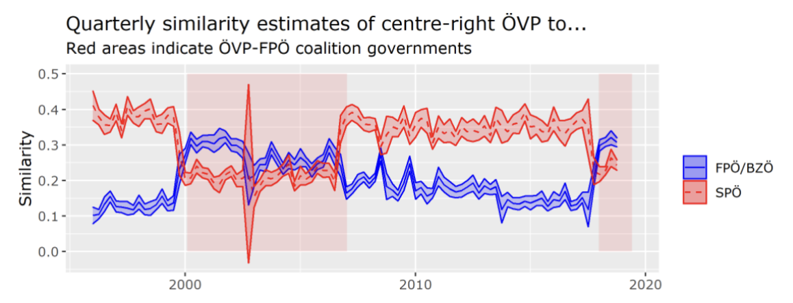
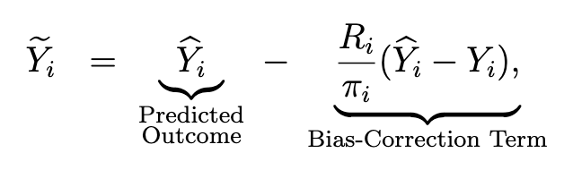
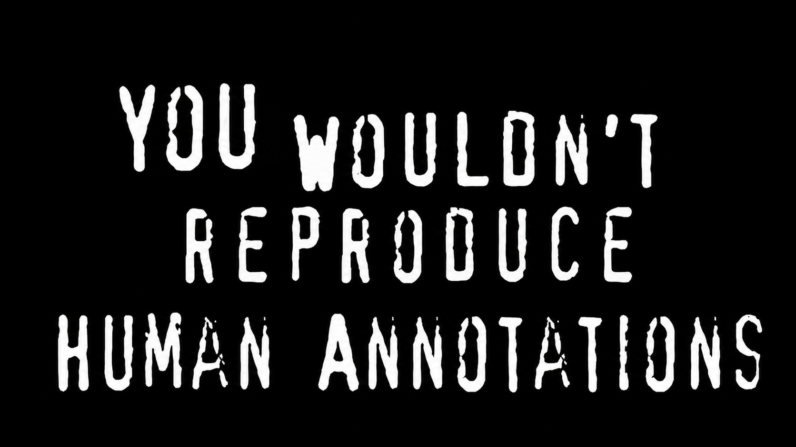

# Validation

## What is Validity?

<br><br>

> Valid measurement is achieved when scores [...] meaningfully capture the ideas contained in the corresponding concept. [@Adcock_Collier_2001, p. 530]

<br>

::: fragment

### Goal: establish that we measure what we think we measure

:::

## Three Types of Validation 

### @Adcock_Collier_2001

<br>

::: incremental

1. **Convergent/Discriminant Validation**: indicators should be correlated with other indicators of the same concept
2. **Content Validation**: indicators should be representative of the concept's domain
3. **AHEM/construct validation**: indicators should behave as expected

:::

## Convergent Validation

<br><br>


- Idea: Measure should <mark>correlate</mark> with other measures of the concept
- Forgotten idea: should also discriminate between different concepts (discriminant validation)
- Dominant approach in social sciences (human validation)
- Easy to measure, no deep thinking about the concept required


## Common Metrics for Convergent Validation

::::: columns
::: {.column width="30%"}

:::

::: {.column width="70%"}
<br>

| Term          | Meaning                                      |
|:--------------|:---------------------------------------------|
| **Accuracy**  | How much does it get right overall?          |
| **Recall**    | How much of the relevant cases does it find? |
| **Precision** | How many of the found cases are relevant?    |
| **F1 Score**  | Weighted average of precision and recall.    |
:::
:::::

## Issues with Common Metrics

```{r acc}

library(tidyverse)

base_rate <- seq(0, 1, 0.01)

accuracy <- function(base_rate, pred_rate) {
    (base_rate * pred_rate + (1 - base_rate) * (1 - pred_rate)) /
        (base_rate * pred_rate + (1 - base_rate) * (1 - pred_rate) + (1 - base_rate) * pred_rate + base_rate * (1 - pred_rate))
}

df <- expand.grid(base_rate = base_rate)
df$pred_rate <- df$base_rate
df$accuracy <- accuracy(df$base_rate, df$pred_rate)

ggplot(df, aes(x = base_rate, y = accuracy)) +
    geom_line() +
    labs(title = "Accuracy of uninformative classifier as a function of prevalence",
         x = "Prevalence",
         y = "Accuracy") +
    theme_minimal()

```

::: aside
Optimal random guess is random guess using base rate as prediction probability.
:::

## Issues with Common Metrics


```{r f1adv}

df <- expand.grid(base_rate = base_rate, pred_rate = seq(0.1, 0.9, 0.1))

precision <- function(base_rate, pred_rate) {
    (base_rate * pred_rate) / ((base_rate*pred_rate) + ((1 - base_rate) * pred_rate))
}

recall <- function(base_rate, pred_rate) {
    (base_rate*pred_rate) / (base_rate * pred_rate + base_rate * (1 - pred_rate))
}

f1 <- function(base_rate, pred_rate) {
    2 * precision(base_rate, pred_rate) * recall(base_rate, pred_rate) / (precision(base_rate, pred_rate) + recall(base_rate, pred_rate))
}

f1_macro <- function(base_rate, pred_rate) {
    f1_pos <- f1(base_rate, pred_rate)
    f1_neg <- f1(1 - base_rate, 1 - pred_rate)
    (f1_pos + f1_neg) / 2
}

f1_wtd <- function(base_rate, pred_rate) {
    f1_pos <- f1(base_rate, pred_rate)
    f1_neg <- f1(1 - base_rate, 1 - pred_rate)
    (base_rate * f1_pos + (1 - base_rate) * f1_neg)
}

df$`F1 macro` <- f1_macro(df$base_rate, df$pred_rate)
df$`F1 weighted` <- f1_wtd(df$base_rate, df$pred_rate)

df %>%
    pivot_longer(
        cols = c(`F1 macro`, `F1 weighted`), 
        names_to = "metric", values_to = "value"
        ) %>%
    ggplot(aes(x = base_rate, y = value, group = pred_rate)) +
    geom_line(aes(color = pred_rate)) +
    labs(title = "F1 Macro and F1 Weighted as a Function of Outcome and Prediction Prevalence",
         x = "Prevalence",
         y = "Value") +
    theme_minimal() +
    facet_grid(~metric)

```


## Best Practice Convergent Validation


- Compare against informative baselines
  - Random prediction at prevalence rate
  - Compare classifiers of varying complexity
- Think about metric of interest (cancer detection vs. ad targeting)
- Use prevalence-insensitive metrics:
  - Matthew's correlation coefficient (MCC)
  - Youden's J/Bookmakers informedness (BM)


## Content Validation

<br>

- Idea: indicators should be <mark>representative</mark> of the concept's domain
- Example: if we want to measure political ideology, we should not only measure economic ideology, but also social ideology
- Rare in Social Science NLP/LLM research
- Benchmarks go in this direction - but unrelated to most social scientists' research questions

## Example: HateCheck



## AHEM Validation

> Assume the Hypothesis, Evaluate the Measure.

- Idea: valid measures <mark>should be able to detect known phenomena</mark>
- Also known as construct validation (though this refers to different types of validation in the social sciences)
- Problem: often post-hoc statement of hypothesis OR using evidence for validity of the measure and hypothesis simultaneously
- Hard with LLMs: we're not sure what is in the training data

## Example: @berk2020party

<br>




## Validation and LLMs

<br>

- Validation must take place *after* the prompt was developed
- Validation set must be sufficiently large [@tomas-valiente2024testsampleR]
- Decide <mark>a priori</mark> on the performance metric based on measurement considerations
- Ensure to use validation data that is not used for training the model

## Discussion

### How would you validate a measure of political ideology in online discussions using LLMs?

<br>

### Discuss in Groups of 2-3:

- What types of validation checks could you conduct?
- What could we do to ensure these checks are not already in the LLM's training data?
- How can we address post-hoc adaptation ("HARKing")?

# Bias & Debiasing

## Bias

<br>

- ML annotations are often inherently biased
- If we use biased measures in our statistical models, our estimates will be biased as well
- This issue is even bigger for LLMs, where the training data is often not known

## Bias: Example

> Do employers favor certain nationalities, holding skills constant?

- You have a dataset of candidate profiles and whether they got an offer for a position or not.
- You measure skill level using a GPT annotation of the candidate profiles.
- You regress hiring decisions on applicants' nationality and skill level.

. . .

#### What might be the issue here?

## Bias: Example

<br>

- Let's assume GPT annotates Croatians as less skilled, other things equal.
- At the same time, employers are discriminating against Croatians.
- Depending on the strength of each bias, Croatians might be estimated to be treated equally or even less discriminated against!

## Summary

<br>

- When we use machine predictions, especially from LLMs, we might introduce unknown bias
- This will bias our estimates and lead to faulty hypothesis testing
- Worst case, this will lead to worse science

. . .

### Thankfully, someone had an idea.

## Design-based supervised learning (DSL)

@egami2024using

<br>

- Corrects statistical estimates based on ML/LLM predictions by using annotated gold-standards
- Two major components:
  1. Use expert annotations to provide "ground truth" labels
  2. Cross-fitting (less important for now)

::: aside
See also @teblunthuis2024misclassification
:::

## DSL - Simplified Intuition

<br>

- In a regression, DSL corrects the estimates **where the model deviates from the expert** by replacing these annotations with the expert labels
- Replace value with inverse sampling weights to correct for the fact that we only have expert labels for a subset of the data
- Then regress this outcome on our predictors
- Also works when using ML estimates as predictors


::: aside

Note: They also use cross-fitting, but to fully understand the method, I recommend you read their [paper aimed at social scientists](https://naokiegami.com/paper/dsl_ss.pdf).

:::

## DSL - Core Adjustment



- $Y_i$: gold label
- $\hat{Y}_i$: ML prediction
- $R_i$: 1 if document i is expert-coded and 0 otherwise
- $\hat{\pi}_i$: estimated probability of being annotated by expert

## DSL - Application

<br><br>


```{r}
#| eval: false
#| echo: true
dsl(model = "logit", 
      formula = outcome ~ ground_truth + covariates,
      predicted_var = "ground_truth",
      prediction = "prediction",
      data = data)

```

::: aside

More: https://naokiegami.com/dsl/


:::


# Reproducibility

## Reproducibility



### Do we need reproducibility for LLMs?


## Reproducibility

<br>

- Reproducibility is often very hard with LLMs
- Proprietary models go out of fashion - stick to open source
- Try to stick to the same infrastructure
- Explicitly define the relevant parameters to ensure reproducibility (next slide)


## Reproducibility Parameters

<br>

- Seeds
- Model version (where possible)
- Temperature (should be 0)
- top-k (should be 1)

# Misc

## Climate Impact

- LLMs use up substantial amounts of energy and water and contribute to carbon emissions.
- Training GPT-3 alone is estimated to have produced 552 tons of carbon dioxide. Thats 500+ flights Zurich-New York.
- Data centers might already have 2.5 times the energy consumption of France ([MIT News](https://news.mit.edu/2025/explained-generative-ai-environmental-impact-0117)) and accounts for half of all new consumed energy ([Fortune](https://fortune.com/2026/04/20/us-data-center-electricity-demand-public-opinion/)).
- **Use smaller models when possible - this is also economical**.
- [`codecarbon`](https://github.com/mlco2/codecarbon) can track the emissions of your own training.

## Security

<br>

- Do not send your sensitive data to Third Party APIs
- Talk to your university IT about provided infrastructure
- Use your own endpoints
- Ensure compliance with data protection regulations (e.g. servers in Europe)


# Conclusion

## Takeaways

- General understanding of how LLMs work
- Window-shopping many tools
  - Embeddings for assessment of word and sentence meaning
  - Bag-of-words models for interpretable machine learning
  - Encoder models for classification, similarity assessment, ...
  - Decoder models for text generation and completion
- Understanding of how to validate and debias LLMs

# Fin!


I learned a lot, thank you very much!


## Resources

<br>
